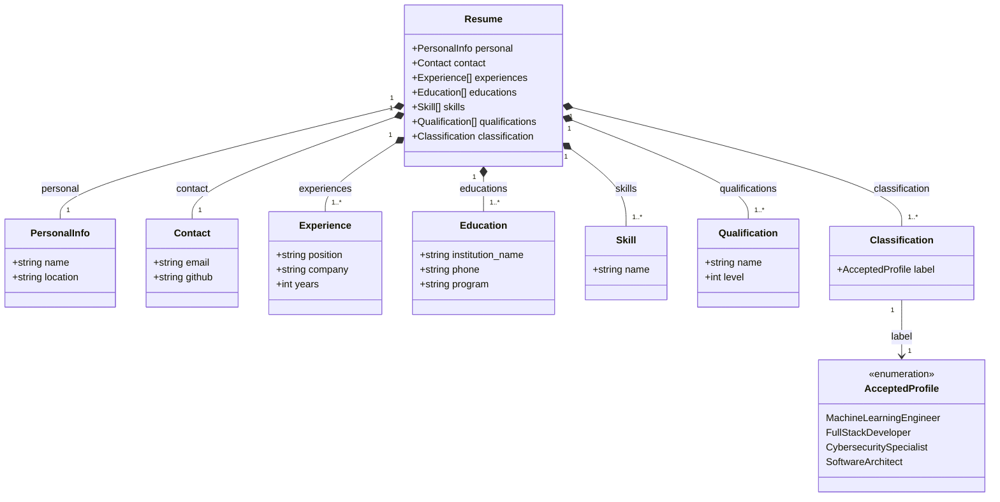

## Overview

The metamodel describes the classes that textX automatically generates from the grammar defined in `grammar/resume.tx`. Each rule in the grammar becomes a class, and each field inside a rule becomes an attribute of that class

## Main classes

**Resume**: root class of the model. Groups all the information of a candidate.
- `personal`: PersonalInfo (1)
- `contact`: Contact (1)
- `experiences`: list of Experience (1 or more)
- `educations`: list of Education (1 or more)
- `skills`: list of Skill (1 or more)
- `qualifications`: list of Qualification (1 or more)
- `classification`: Classification (1)

**PersonalInfo**: basic information about the candidate.
- `name`: string
- `location`: string

**Contact**: contact information.
- `email`: string
- `github`: string (optional)

**Experience**: a work experience entry. A Resume can have several.
- `position`: string
- `company`: string
- `years`: int

**Education**: an academic background entry. A Resume can have several.
- `institution_name`: string
- `phone`: string
- `program`: string

**Skill**: a single skill. A Resume can have several.
- `name`: string

**Qualification**: a normalized qualification for a skill or topic. A Resume can have several.
- `name`: string
- `level`: int

**Classification**: result of the candidate profile classification.
- `label`: AcceptedProfile (restricted to one of the accepted profile values)

**AcceptedProfile**: an enumeration of the profile categories accepted by ResumeLens. It is not an independent object, it only restricts the valid values for `Classification.label`.
- Machine Learning Engineer
- Full Stack Developer
- Cybersecurity Specialist
- Software Architect

## Relationships

Resume is the container class: every other class exists only as part of a Resume, which makes this a composition relationship (deleting the Resume deletes its parts). PersonalInfo, Contact and Classification have a 1-to-1 cardinality with Resume, since a candidate has exactly one of each. Experience, Education, Skill and Qualification have a 1-to-many cardinality with Resume, since a candidate can report several of each (minimum one, no upper limit).

## Diagram

