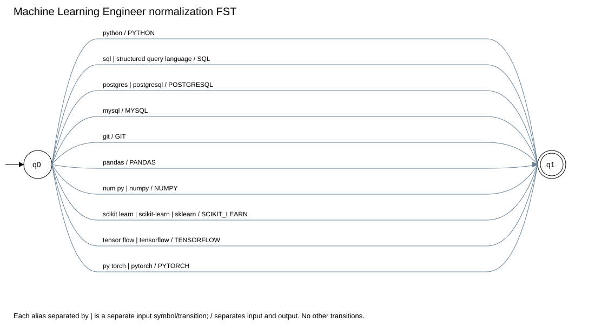
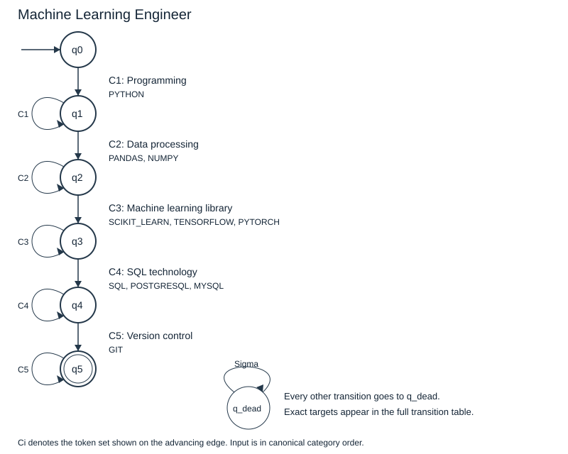

# Machine Learning Engineer formal models

## Stage 1 qualification expressions

All expressions use `re.IGNORECASE`. The extractor returns the original matched text.

| Term | Recognized aliases |
|---|---|
| PYTHON | Python |
| PANDAS | Pandas |
| NUMPY | NumPy, Num Py |
| SCIKIT_LEARN | Scikit-learn, scikit learn, sklearn |
| TENSORFLOW | TensorFlow, Tensor Flow |
| PYTORCH | PyTorch, Py Torch |
| SQL | SQL, Structured Query Language |
| POSTGRESQL | PostgreSQL, Postgres |
| MYSQL | MySQL |
| GIT | Git |

Exact expressions:

```text
PYTHON: (?<!\w)(?:Python)(?!\w)
PANDAS: (?<!\w)(?:Pandas)(?!\w)
NUMPY: (?<!\w)(?:Num\s+Py|NumPy)(?!\w)
SCIKIT_LEARN: (?<!\w)(?:Scikit\-learn|scikit\s+learn|sklearn)(?!\w)
TENSORFLOW: (?<!\w)(?:Tensor\s+Flow|TensorFlow)(?!\w)
PYTORCH: (?<!\w)(?:Py\s+Torch|PyTorch)(?!\w)
SQL: (?<!\w)(?:Structured\s+Query\s+Language|SQL)(?!\w)
POSTGRESQL: (?<!\w)(?:PostgreSQL|Postgres)(?!\w)
MYSQL: (?<!\w)(?:MySQL)(?!\w)
GIT: (?<!\w)(?:Git)(?!\w)
```

## Stage 2 finite state transducer

M = (Q, Sigma, Gamma, delta, omega, q0, F).

- Q = {q0, q1}; q0 is initial and F = {q1}.
- Sigma is the finite set of input tokens in the table below; each complete alias is one atomic symbol.
- Gamma = {PYTHON, PANDAS, NUMPY, SCIKIT_LEARN, TENSORFLOW, PYTORCH, SQL, POSTGRESQL, MYSQL, GIT}.
- For each table row (x, y): delta(q0, x) = q1 and omega(q0, x) = [y]. All other transitions are absent.
- The FST processes one extracted term at a time; it is reset between terms. An unknown term has no translation.
- Before translation, `casefold` and whitespace squeezing only unify the lexical representation. Alias equivalence is performed by the FST.

| Input token x | Output token y | delta | omega |
|---|---|---|---|
| `python` | `PYTHON` | q0 to q1 | [PYTHON] |
| `pandas` | `PANDAS` | q0 to q1 | [PANDAS] |
| `num py` | `NUMPY` | q0 to q1 | [NUMPY] |
| `numpy` | `NUMPY` | q0 to q1 | [NUMPY] |
| `scikit learn` | `SCIKIT_LEARN` | q0 to q1 | [SCIKIT_LEARN] |
| `scikit-learn` | `SCIKIT_LEARN` | q0 to q1 | [SCIKIT_LEARN] |
| `sklearn` | `SCIKIT_LEARN` | q0 to q1 | [SCIKIT_LEARN] |
| `tensor flow` | `TENSORFLOW` | q0 to q1 | [TENSORFLOW] |
| `tensorflow` | `TENSORFLOW` | q0 to q1 | [TENSORFLOW] |
| `py torch` | `PYTORCH` | q0 to q1 | [PYTORCH] |
| `pytorch` | `PYTORCH` | q0 to q1 | [PYTORCH] |
| `sql` | `SQL` | q0 to q1 | [SQL] |
| `structured query language` | `SQL` | q0 to q1 | [SQL] |
| `postgres` | `POSTGRESQL` | q0 to q1 | [POSTGRESQL] |
| `postgresql` | `POSTGRESQL` | q0 to q1 | [POSTGRESQL] |
| `mysql` | `MYSQL` | q0 to q1 | [MYSQL] |
| `git` | `GIT` | q0 to q1 | [GIT] |



[Complete FST transition graph](diagrams/machine_learning_fst.dot)

## Stage 3 deterministic finite automaton

M = (Q, Sigma, delta, q0, F).

- Q = {q0, q1, q2, q3, q4, q5, q_dead}.
- Sigma = {PYTHON, PANDAS, NUMPY, SCIKIT_LEARN, TENSORFLOW, PYTORCH, SQL, POSTGRESQL, MYSQL, GIT}.
- Initial state: q0. F = {q5}.
- delta is defined for every state and every symbol by the matrix below; q_dead is a nonaccepting sink.
- qi records that the first i categories have been satisfied. Repeated alternatives in the current category keep the same state.
- A skipped, decreasing or unknown category is rejected. The pipeline sorts and deduplicates first, so the résumé's original order does not affect the result.
- There is exactly one destination per state/symbol pair and no epsilon transition: this is a DFA.

The language is L = C1+ C2+ ... Ck+. Within each Ci, alternatives are OR; across categories, requirements are AND.

| Category | Required evidence |
|---|---|
| C1: Programming | PYTHON |
| C2: Data processing | PANDAS or NUMPY |
| C3: Machine learning library | SCIKIT_LEARN or TENSORFLOW or PYTORCH |
| C4: SQL technology | SQL or POSTGRESQL or MYSQL |
| C5: Version control | GIT |



[All DFA edges in DOT format](diagrams/machine_learning_dfa.dot)

## Full transition matrix

An arrow marks the initial state; * marks the accepting state.

| State | PYTHON | PANDAS | NUMPY | SCIKIT_LEARN | TENSORFLOW | PYTORCH | SQL | POSTGRESQL | MYSQL | GIT |
|---|---|---|---|---|---|---|---|---|---|---|
| -> q0 | q1 | q_dead | q_dead | q_dead | q_dead | q_dead | q_dead | q_dead | q_dead | q_dead |
| q1 | q1 | q2 | q2 | q_dead | q_dead | q_dead | q_dead | q_dead | q_dead | q_dead |
| q2 | q_dead | q2 | q2 | q3 | q3 | q3 | q_dead | q_dead | q_dead | q_dead |
| q3 | q_dead | q_dead | q_dead | q3 | q3 | q3 | q4 | q4 | q4 | q_dead |
| q4 | q_dead | q_dead | q_dead | q_dead | q_dead | q_dead | q4 | q4 | q4 | q5 |
| * q5 | q_dead | q_dead | q_dead | q_dead | q_dead | q_dead | q_dead | q_dead | q_dead | q5 |
| q_dead | q_dead | q_dead | q_dead | q_dead | q_dead | q_dead | q_dead | q_dead | q_dead | q_dead |

## Limitations

The model recognizes explicitly named qualifications under the proposed category policy. It does not rank candidates, infer proficiency, handle negated claims or verify experience. Unrecognized résumé terms do not satisfy a required category.
