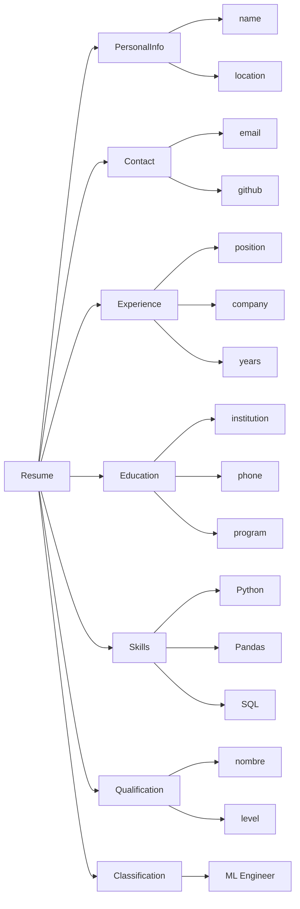

## 3. Language design

## 4. EBNF specification

### 4.1 Terminals

	STRING  
	INT
	"name" 
	"location" 
	"email"
	"github" 
	"position" 
	"company" 
	"years" 
	"institution" 
	"phone" 
	"program" 
	"skill" 
	"qualification" 
	"level" 
	"classification"
	"Machine Learning Engineer" 
	"Full Stack Developer" 
	"Cybersecurity Specialist" 
	"Software Architect"
	"Data Architect"

### 4.2 Non Terminals
	
	Resume 
	PersonalInfo 
	Contact 
	Experience 
	Education 
	Skill 
	Qualification 
	Classification
	AcceptedProfile
	Name
	Location
	Email
	Github
	Position
	Company
	Years
	InstitutionName 
	Phone
	Program

### 4.3 EBNF rules
	Resume ::= PersonalInfo Contact Experience+ Education+ Skill+ Qualification+ Classification+
	PersonalInfo ::= "name" Name "location" Location 
	Contact ::= "email" Email [ "github" Github ] 
	Experience ::= "position" Position "company" Company "years" Years
	Education ::= "institution" InstitutionName "phone" Phone "program" Program
	Skill ::= "skill" STRING 
	Qualification ::= "qualification" STRING "level" INT
	Classification ::= "classification" AcceptedProfile 
	AcceptedProfile ::= "Machine Learning Engineer" | "Full Stack Developer" | "Cybersecurity Specialist" | "Data Architect" | "Software Architect"
	Name ::= STRING
	Location ::= STRING
	Email ::= STRING
	Github ::= STRING
	Position ::= STRING
	Company ::= STRING
	Years ::= INT
	InstitutionName ::= STRING 
	Phone ::= STRING 
	Program ::= STRING

`Data Architect` is the team's current AI/data profile. `Software Architect` is retained only for compatibility with the previous Follow-up 3 examples; the current integradora defines four classifiers, not five.

`+` means one or more repetitions; brackets mean optional. STRING and INT are textX lexical rules for quoted strings and integers. The executable grammar is `src/stage4/grammar/resume.tx`; ranges and nonempty contents are checked by the business validator, not these lexical rules.
