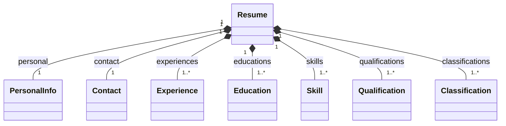

# textX metamodel

The executable grammar is `src/stage4/grammar/resume.tx`. textX builds candidate objects from its rules; the parsed Resume is the model, not the metamodel.

| Class | Attributes |
|---|---|
| Resume | personal: PersonalInfo; contact: Contact; experiences: Experience[1..*]; educations: Education[1..*]; skills: Skill[1..*]; qualifications: Qualification[1..*]; classifications: Classification[1..*] |
| PersonalInfo | name: string; location: string |
| Contact | email: string; github: optional string |
| Experience | position: string; company: string; years: integer |
| Education | institution_name: string; phone: string; program: string |
| Skill | name: string |
| Qualification | name: string; level: integer |
| Classification | label: AcceptedProfile |

AcceptedProfile is a match rule returning a label, not an independent candidate object. Current labels: Machine Learning Engineer, Data Architect, Full Stack Developer and Cybersecurity Specialist. Software Architect remains a historical compatibility label, not a fifth active classifier.

Resume contains exactly one PersonalInfo and Contact and at least one of each repeated record, including Classification. Syntax creates these relationships; business validation separately checks mandatory text, ranges, formats and duplicates. See [validation](validacion.md).

The tree diagrams in `docs/data_profiles/diagrams/*_tree.svg` show validated model instances, including both classifications in the combined example.
